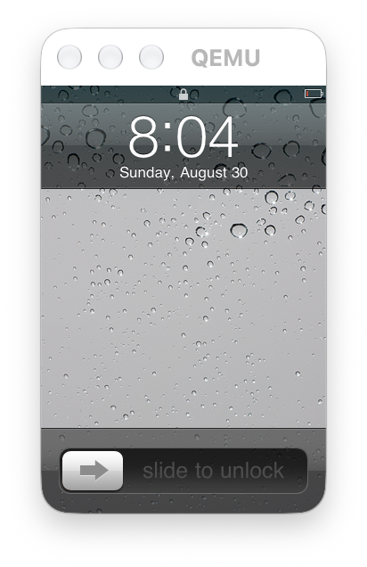

==========
qemu-ios-4
==========

An experimental QEMU machine for the iPhone 3G (``iPhone1,2`` / ``N82AP``),
capable of restoring and running iOS 4.2.1 to an interactive SpringBoard.

The macOS frontend provides a resizable Cocoa window, mouse-driven touch,
Home and Power buttons, persistent storage, USB transport, and optional PPP
networking. Cold boots are slow under ARM TCG; ready-state checkpoints provide
the practical development loop.

Quick start
===========

macOS and Python 3.11 or newer are required for the complete graphical path.

.. code-block:: shell

   ./scripts/ios/bootstrap-macos.sh
   ./scripts/ios/fetch-firmware.sh
   make -C build iphone3g-test
   make -C build iphone3g-help

The first restore is a stateful process. Follow the `iPhone 3G guide
<docs/system/arm/iphone3g.rst>`_ once; subsequent sessions start with:

.. code-block:: shell

   make -C build iphone3g-play

Scope
=====

This is a research and preservation project, not a complete iPhone emulator.
Telephony, the baseband, camera, host audio output, and exact NAND ECC are not
implemented. Apple firmware and virtual-device storage are never bundled with
the repository.

See `CONTRIBUTING.md <CONTRIBUTING.md>`_ to contribute and `SECURITY.md
<SECURITY.md>`_ to report a vulnerability. QEMU is GPL-2.0 licensed; see
`LICENSE <LICENSE>`_ and `LICENSES/MIT.txt <LICENSES/MIT.txt>`_ for details.

Apple, iPhone, and iOS are trademarks of Apple Inc. This project is not
affiliated with or endorsed by Apple.
